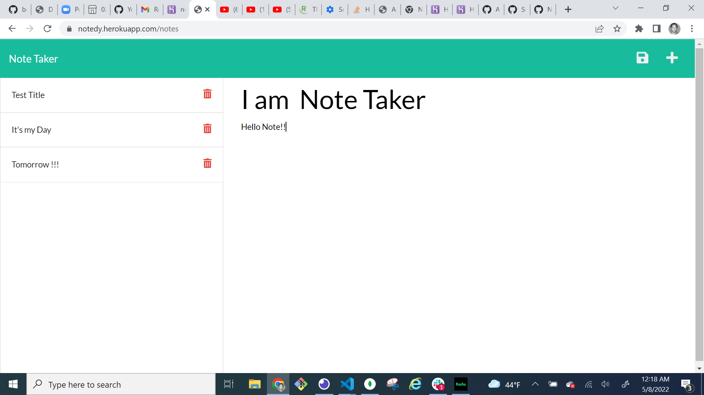

# NOTED

Usage
You will need node.js to run this application. Once the repository has been cloned navigate to the file directory and run the following command.

node server.js

## License
This project is licensed under the MIT license.

# Technology Used
## Javascript
## Node.js
## Express.js npm package
## Node.js FS Module
## Node.js Path module
## Node.js UUIDv4 module

## Questions
If you have any questions about the repo, open an issue or contact me directly at esal29t@gmail.com. You can find more of my work at https://github.com/Nderingo.

